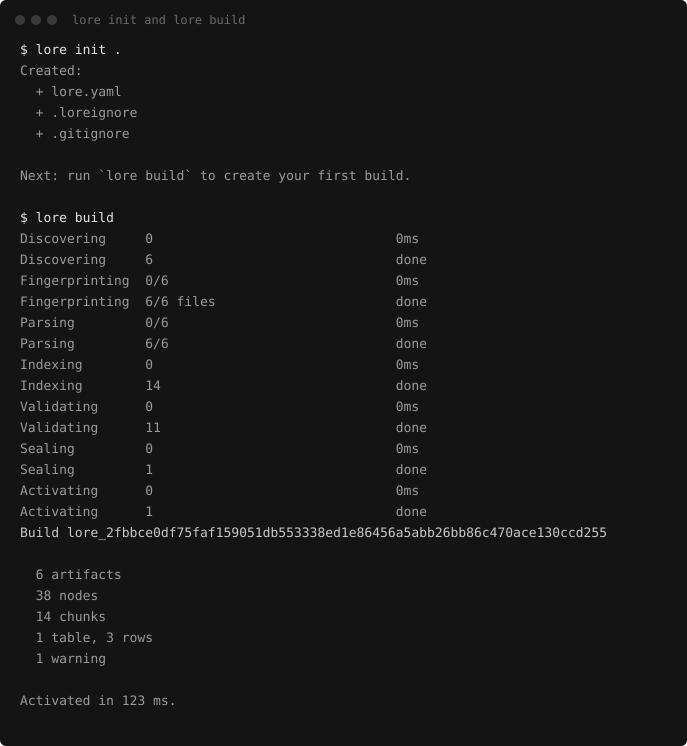
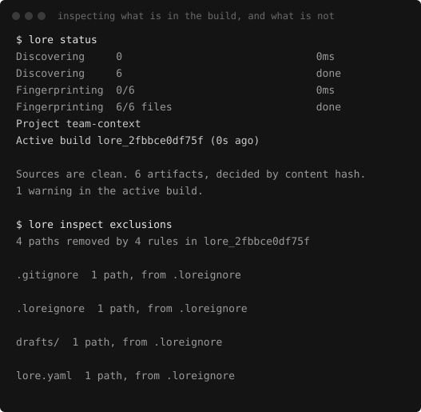
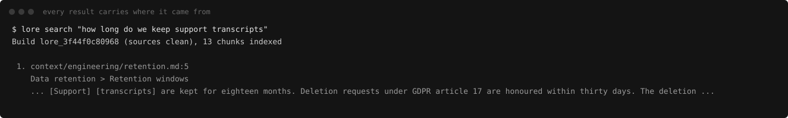

# Lorepack

**Build, version, and deploy the context your AI depends on.**

Lorepack compiles a directory of documents, spreadsheets and project artifacts into an
**immutable, content-addressed build** that can be inspected, diffed, deployed, activated
and rolled back, then read by chat models and coding agents over MCP, HTTP, or a bounded
export.

Think *Git and Terraform for AI context*. It is not another local RAG server: retrieval is
a runtime capability, the build lifecycle is the product.

```text
source artifacts → plan → deterministic build → immutable version
                 → validate → activate atomically → diff / roll back
```

## Status

**Pre-v0.1. Under active construction, not yet installable.**

`lore` does not exist as a published package. Everything shown below runs today from a clone,
and the images are generated from a real build by `pnpm docs:capture`, but nothing is
released. Follow along in the [backlog](https://github.com/users/burakdede/projects/8).

Working now: the local lifecycle, retrieval with provenance, MCP and HTTP serving, the
`lore connect` flow for Claude Code, and Studio. Still to come: PDF, DOCX and spreadsheet
parsers, the read-only SQL surface over tables, precedence rules, more clients, and the
Cloudflare projection.

## The two commands

```bash
lore dev ./project-context     # discover, build, serve, watch, and print where everything is
lore connect claude-code       # configure an AI client, and prove it answers
```

`lore dev` on a folder that has never seen Lorepack writes the configuration, builds, activates,
serves and starts watching. There is nothing to set up first.



Everything the build decided is inspectable without re-running it, including the decisions
that removed a file:



Every result carries the file, the heading path and the lines it came from. A result without
one is a bug, not a style issue:



## Studio

`lore dev` prints a Studio URL. It is five routes served from static files by the same process
that serves the API, on the same port, with no toolchain and no network.

| Route | The question it answers |
|---|---|
| Overview | What is in this build, and have the sources moved on since it was made? |
| Sources | Exactly what was parsed, and exactly what was not, and why |
| Playground | What would a model actually receive for this task, and what was left out |
| Versions | What changed between two builds, and which one is live |
| Diagnostics | Why is this not working, and what do I run to fix it |

**Overview.** Source state first, because it is the only thing on the page that changes while
you are reading it.


**Playground.** The passages a model would receive for a task, each with its provenance, and
every omission with the reason it was left out. Nothing here is presented as a score of truth.


**Sources**, on the half that usually gets buried: what is *not* in the build. A rule that
removed a folder and a file no parser could read are different decisions, and both are named.


**Versions.** Every action that changes anything shows a plan, names the build it will act on,
and is confirmed first. Activation is a pointer change, so rollback never recompiles.


**Diagnostics** renders the same checks `lore doctor` prints, plus what only a running session
knows: the watcher, the port, the process, and which clients are configured.


Studio is read-mostly. The only routes that change anything exist solely under `lore dev`, and
they refuse any browser origin that is not a loopback literal.

## Requirements

Node.js `>=24.15 <25`, and that is the whole list. No Python, Docker, compiler toolchain,
native add-on, model download, API key or account.

The floor is 24.15 because that is the first release where `node:sqlite` exposes the
authorizer and per-connection limits the read-only SQL surface depends on. Lorepack also
needs SQLite compiled with FTS5, which every official Node build has; see
[SQLite FTS5 availability](docs/compatibility/sqlite-fts5.md) for the verified matrix and
what happens if yours does not.

## Design commitments

- **The build is the source of truth.** Every runtime is a projection of an immutable build.
- **Deterministic.** Identical inputs produce an identical build ID on every OS.
- **Provenance always.** Every result traces to a file, section, page, sheet or cell range.
- **No surprises on first run.** No Python, Docker, compiler toolchain, native add-on,
  model download, API key or account.
- **Never invents truth.** Precedence between sources is declared by you, never guessed.

## Limitations, honestly

- **Markdown, HTML, text-layer PDF, plain text and source code** for now. A spreadsheet or a
  Word document is reported as a format supported in a later release, not as an error, and it
  is named in the build's exclusions rather than silently skipped. A scanned PDF is refused
  outright rather than indexed as an empty document: OCR is out of scope for v0.1.
- **Lexical retrieval only.** BM25 with declared ranking hints. No embeddings in the default
  install, and the score is presented as a ranking heuristic because that is what it is.
- **One project, one machine.** No tenancy, no accounts, no hosted control plane.
- **The scale envelope is 2,500 files and 1 GB.** Past that Lorepack asks you to confirm and
  says plainly that the behaviour is untested rather than unsupported.
- **Precedence is declared, never detected.** Lorepack will not tell you which of two documents
  is correct, and does not claim to have found a conflict.

## Documentation

| | |
|---|---|
| Working agreement for contributors and agents | [`AGENTS.md`](AGENTS.md) |
| Full architecture specification | [`Lorepack_Local_First_MVP_Architecture_Final.md`](Lorepack_Local_First_MVP_Architecture_Final.md) |
| How to contribute | [`CONTRIBUTING.md`](CONTRIBUTING.md) |
| Reporting a vulnerability | [`SECURITY.md`](SECURITY.md) |
| The `lore` command line | [`docs/architecture/cli.md`](docs/architecture/cli.md) |
| How a build is produced, and why the stage order matters | [`docs/architecture/build-orchestration.md`](docs/architecture/build-orchestration.md) |
| What belongs in a build, and what does not | [`docs/architecture/discovery.md`](docs/architecture/discovery.md) |
| How each format is read, and what is deliberately dropped | [`docs/architecture/parsers.md`](docs/architecture/parsers.md) |
| How a model reaches a build, over MCP and HTTP | [`docs/architecture/serving.md`](docs/architecture/serving.md) |
| Studio: behaviour, the manual passes, and the design direction | [`docs/architecture/studio.md`](docs/architecture/studio.md) |
| Connecting Claude Code | [`docs/integrations/claude-code.md`](docs/integrations/claude-code.md) |

## Licence

[Apache-2.0](LICENSE).
