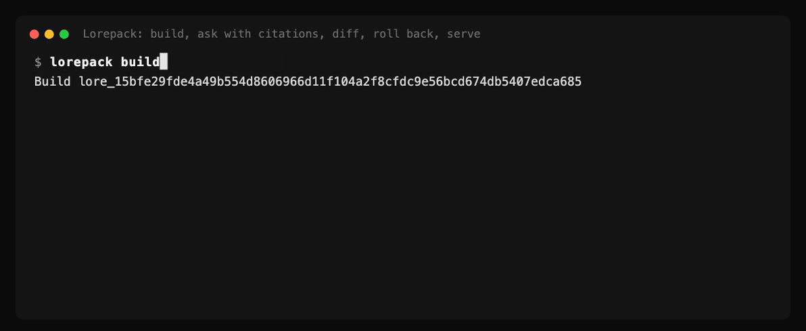
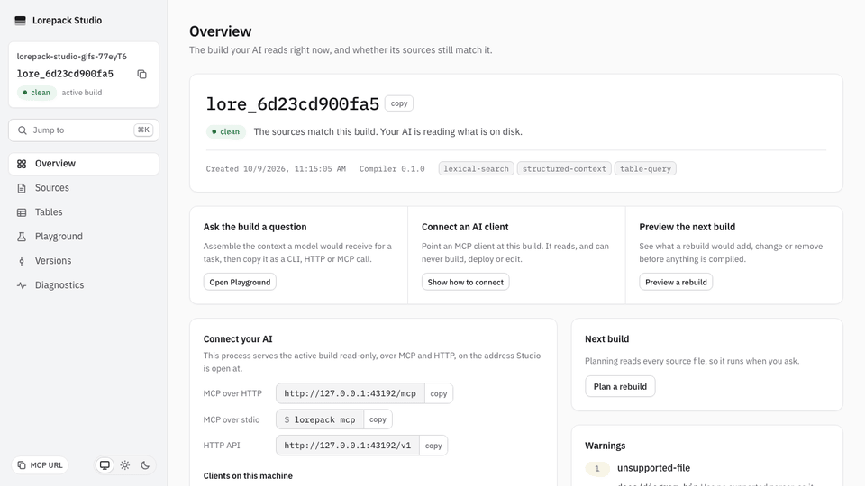
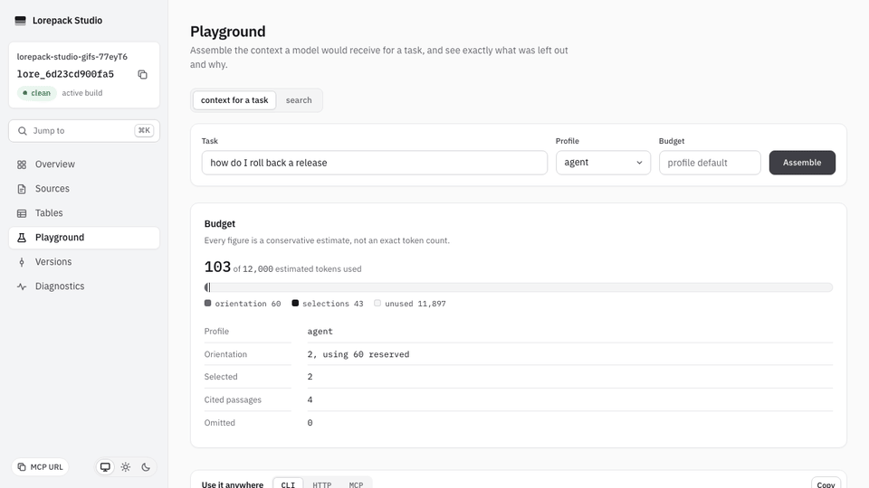
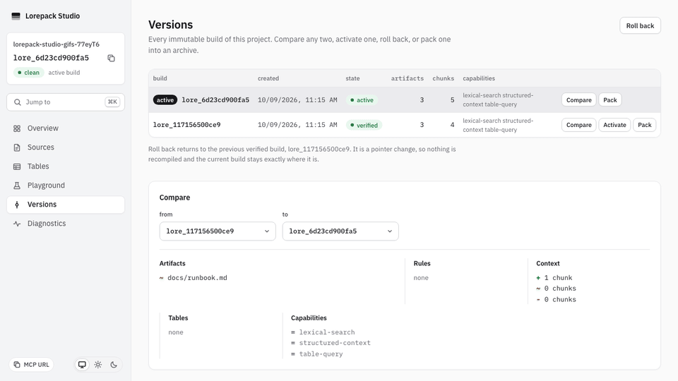
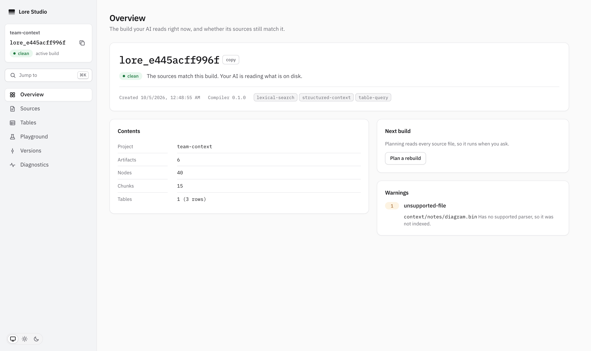

# Lorepack

Lorepack turns the documents and tables your AI depends on into versioned context builds.
It gives an agent a stable, inspectable source of truth instead of an untracked folder or a
mutable search index.

Every build is immutable and content-addressed. You can inspect what entered it, see what was
excluded and why, ask for bounded context with citations, compare versions, activate a known
version, and roll back without rebuilding. AI clients read the active build over MCP or HTTP.
They cannot edit sources, build, deploy, or run shell commands through the Lorepack boundary.

## Why teams use it

Lorepack is for teams whose AI answers must be grounded in project material that changes over
time:

- Keep engineering runbooks, product specifications, policies, and operational notes in a
  reviewable context build.
- Let Claude Code, Codex, VS Code, or another MCP client answer from the same local build.
- Preserve spreadsheets as typed tables instead of flattening them into prose.
- Review a context update before activating it, then recover immediately if a bad source update
  reaches the active version.
- Inspect every answer back to a file, heading, line range, sheet, or cell range.

Lorepack is a context build system, not a hosted knowledge base, generic crawler, chat app, or
replacement for your source control. Retrieval is one capability of a versioned build.

## Start in two commands

Requires Node.js `>=24.15 <25`. The first alpha is published on npm's `next` channel:

```bash
npm install -g @lorepack/cli@next
lorepack dev ./my-docs
```

`lorepack dev` builds the folder, starts the local read-mostly server, opens Lorepack Studio,
and prints the MCP and HTTP endpoints. It also prints the connection command for AI clients it
detects on your machine.

To connect an installed client, run the command Studio prints or use:

```bash
lorepack connect claude-code
```

The command changes only that client's Lorepack configuration. It does not upload your sources.
See the [client integration guides](docs/integrations/) for Claude Code, Codex, VS Code, and
generic MCP clients.

### Shell completion

Generate completion for the shell you use:

```bash
eval "$(lorepack completion zsh)"       # zsh
eval "$(lorepack completion bash)"      # bash
lorepack completion fish | source       # fish
lorepack completion powershell | Invoke-Expression
```

Add the matching line to your shell profile when you want completion in every new terminal.
The generated completion covers Lorepack commands and global options without requiring a plugin.



[View the static, reduced-motion version of the demo](docs/images/demo.svg).

## A complete local workflow

### 1. Create a project

For a new context directory, initialize the small set of files Lorepack needs:

```bash
mkdir my-context
cd my-context
lorepack init .
```

This creates `lore.yaml`, `.loreignore`, and the project entries in `.gitignore`. Commit
`lore.yaml`, `lore.lock`, and `.loreignore`. The `.lore/` directory contains local build state
and is intentionally ignored.

Point `lore.yaml` at the directories or files that are part of the context. Keep source files
in their original structure. The [format and parser guide](docs/architecture/parsers.md) lists
the supported formats and their structural behavior.

### 2. Preview and build

Preview what will be read before compiling it:

```bash
lorepack plan
```

Then create and activate an immutable build:

```bash
lorepack build
lorepack status
```

The build output includes a content-addressed id, artifact and chunk counts, tables, warnings,
and activation status. A failed build leaves the active version untouched.

Use `--json` in scripts and CI. Use `--frozen` when the checked-in lockfile must not change:

```bash
lorepack build --frozen --json
```

### 3. Inspect what the AI can read

Search returns source coordinates with every result:

```bash
lorepack search "how long do we keep support transcripts"
```

Inspect the build and its decisions directly:

```bash
lorepack inspect build
lorepack inspect sources
lorepack inspect exclusions
lorepack inspect warnings
```

Assemble bounded context for a task without calling a model:

```bash
lorepack export --task "How should the sync worker recover after a failed deploy?"
```

The export contains the selected passages and their provenance. Lorepack does not summarize
source material or decide which user-declared authority is correct.

### 4. Serve and connect

Use `dev` while editing sources. It rebuilds after changes and keeps Studio, HTTP, and MCP
aligned with the active build:

```bash
lorepack dev ./my-docs
```

For a previously built project that must only serve the active build, use the read-only server:

```bash
lorepack serve
lorepack mcp
```

`lorepack serve` never rebuilds or edits sources. `lorepack mcp` is useful as the command in an
MCP client's stdio configuration. `lorepack connect <client>` writes the client configuration
for you and supports `--dry-run` when you want to inspect the proposed change first.

### 5. Update safely

Edit a source, then see the candidate changes before activation:

```bash
lorepack plan
lorepack build
lorepack diff
lorepack builds
```

The active pointer changes only after validation succeeds. To return to the previous build:

```bash
lorepack rollback
lorepack status
```

Rollback points at an existing immutable build. It does not recompile the sources.

### 6. Package or deploy a build

Create a portable archive and verify it before sharing it:

```bash
lorepack pack --out context.lorepack
lorepack pack --verify context.lorepack
```

Cloudflare deployment is an optional target. It projects the same build rather than compiling a
different representation remotely. Read the [deployment guide](docs/architecture/deployment.md)
before configuring a target.

## Workflows worth copying

### Keep a coding agent on a reviewed context version

```bash
lorepack plan
lorepack build --no-activate
lorepack validate
lorepack diff
lorepack activate
lorepack mcp
```

The agent sees only the active immutable build. If the source change is wrong, `lorepack rollback`
returns to the previous build without parsing or indexing the sources again.

### Investigate a source before changing the build

```bash
lorepack inspect sources
lorepack inspect exclusions
lorepack inspect warnings
lorepack search "where is the deployment rollback procedure"
lorepack export --task "prepare a cited rollback checklist"
```

This is useful when a result is missing. It shows whether the file was parsed, excluded by a
project rule, refused because no parser supports it, or simply did not match the query.

### Review context in Studio

```bash
lorepack dev ./my-docs
```

Open Sources to inspect artifacts and exclusions, Playground to assemble a bounded task bundle,
and Versions to compare, activate, pack, or roll back builds. The same workflows are shown in
the [Studio tour](docs/studio-tour.md):







The GIFs are regenerable with `pnpm docs:studio:gifs`. Static screenshots remain available in
the Studio tour for reduced-motion and offline readers.

### Measure a corpus before making a performance claim

```bash
pnpm bench:corpus -- --scale small --edge-case standard \
  --out benchmarks/corpus/local-small.json
pnpm check:benchmark-artifacts
```

Use `small`, `medium`, or `large` to select scale, and `standard`, `incremental`, `unsupported`,
or `tables` to select an operational edge case. The report includes corpus identity, machine
metadata, build and incremental p50/p95, warm search, context assembly, typed-table latency, and
reuse counts. Read [benchmark methodology](benchmarks/README.md) before comparing results. The
medium and large tiers are deterministic copies of repository-owned mixed-format material, so
they show scale trends rather than proving performance on every customer corpus.

## What makes the build trustworthy

### Immutable identity

The build id comes from canonical inputs, parser and compiler versions, configuration, and
structure. It does not depend on timestamps, hostnames, absolute paths, or physical SQLite
bytes. The same canonical inputs produce the same id across supported operating systems.

### Provenance on every result

Search results, exported context items, and table rows carry a `SourceLocator`. A locator can
name a path, heading, line range, sheet, or cell range. This makes an answer auditable without
requiring Lorepack to claim that one document is more truthful than another.

### Structure before retrieval

Markdown headings, code boundaries, directories, spreadsheet sheets, columns, and cell ranges
remain meaningful inside the build. CSV and XLSX data is stored as typed tables and exposed
through a bounded read-only SQL surface.

### Read-only AI boundary

Model-facing MCP and HTTP capabilities read an immutable active build. They cannot build,
activate, roll back, deploy, modify source files, or execute shell commands. Mutating lifecycle
actions remain explicit CLI or Studio operations performed by the developer.

## Lorepack Studio

`lorepack dev` serves Lorepack Studio locally. It is an inspector for the active build:

- Overview shows the active id, freshness, compiler information, capabilities, warnings, and
  the next rebuild step.
- Sources shows indexed artifacts and excluded files with reasons.
- Playground assembles bounded context and shows selections, omissions, budget accounting, and
  the equivalent CLI, HTTP, and MCP request.
- Tables shows typed schemas, sample rows, and bounded read-only queries when tables exist.
- Versions shows build history, diffs, activation, rollback, and portable packaging.
- Diagnostics shows environment checks, watcher state, and detected AI clients.



Read the [Studio tour](docs/studio-tour.md) for route-by-route screenshots and the actions
behind each view.

## Supported inputs and current boundaries

The alpha supports the document, text, PDF, CSV, and XLSX paths described in the parser guide.
It preserves the structure those parsers expose and records unsupported or excluded files as
warnings. The default install has no Python, Docker, native add-on, model download, API key,
account, or hosted service requirement.

The first public alpha deliberately does not include OCR, images or screenshots, PPTX, SaaS
connectors, multi-user tenancy, automatic conflict detection, generated summaries, embeddings
in the default install, knowledge graphs, conversation memory, agent workflows, or server-side
compilation on Cloudflare. See the complete [limitations](docs/limitations.md) page before
designing a production integration.

## Documentation map

- [Getting started](docs/getting-started.md): requirements, installation, the first build, and
  the lifecycle.
- [Core concepts](docs/concepts.md): why the immutable build is the product and how Lorepack
  differs from RAG servers, MCP wrappers, and vector databases.
- [CLI reference](docs/cli-reference.md): every command, argument, and option.
- [Studio tour](docs/studio-tour.md): the local inspector and its routes.
- [Demo transcript](docs/demo-transcript.md): real output from the complete lifecycle.
- [Client integrations](docs/integrations/): Claude Code, Codex, VS Code, and generic MCP.
- [Architecture](docs/architecture/README.md): package boundaries, build identity, storage,
  serving, security, and deployment.
- [Package format](docs/package-format/README.md): the `.lorepack` archive and generated
  schemas.
- [Compatibility](docs/compatibility/README.md): supported platforms and measured behavior.
- [Benchmark evidence](docs/compatibility/benchmark-evidence.md): reproducible Lorepack, FTS5,
  and offline RAG comparisons, claim ledger, raw artifacts, and review checklist.

## Source installation

Contributors and users testing unreleased changes can build from source:

```bash
git clone https://github.com/burakdede/lorepack.git
cd lorepack
corepack enable
pnpm install --frozen-lockfile
pnpm build
alias lorepack="node $PWD/packages/cli/dist/public-entry.js"
```

Run `lorepack doctor --json` when diagnosing an environment. Include that output, your OS, and
your Node.js version in a bug report.

## Contributing

Read [CONTRIBUTING.md](CONTRIBUTING.md) and [AGENTS.md](AGENTS.md) before changing the project.
The project uses Apache-2.0 licensing. Security reports belong in [SECURITY.md](SECURITY.md).

## License

[Apache-2.0](LICENSE)
