# Lorepack docs

Start here, then take the path that matches the job. The README is the short front door.
This directory holds the institutional-grade details: command references, architecture notes,
integration guides, compatibility evidence, package format and release checks.

## Reader paths

| Reader | Start with | Then use |
|---|---|---|
| Evaluator | [`../README.md`](../README.md) | [`concepts.md`](concepts.md), [`studio-tour.md`](studio-tour.md), [`demo-transcript.md`](demo-transcript.md) |
| User | [`getting-started.md`](getting-started.md) | [`integrations/`](integrations/), [`limitations.md`](limitations.md), [`compatibility/README.md`](compatibility/README.md) |
| Technical operator | [`cli-reference.md`](cli-reference.md) | [`package-format/README.md`](package-format/README.md), [`release-checklist.md`](release-checklist.md) |
| Integrator | [`integrations/mcp.md`](integrations/mcp.md) | [`architecture/serving.md`](architecture/serving.md), [`architecture/deployment.md`](architecture/deployment.md) |
| Contributor | [`../CONTRIBUTING.md`](../CONTRIBUTING.md) | [`architecture/README.md`](architecture/README.md), [`architecture/testing.md`](architecture/testing.md), [`../AGENTS.md`](../AGENTS.md) |

## Using Lorepack

| Need | Document |
|---|---|
| Install, the first build, and the full lifecycle | [`getting-started.md`](getting-started.md) |
| What Lorepack is, why it exists, and how it differs from RAG, MCP wrappers and vector databases | [`concepts.md`](concepts.md) |
| What v0.1 does not do | [`limitations.md`](limitations.md) |
| Every command and option | [`cli-reference.md`](cli-reference.md) |
| A tour of Studio, one screenshot per route | [`studio-tour.md`](studio-tour.md) |
| The lifecycle demo, as real output | [`demo-transcript.md`](demo-transcript.md) |
| Worked examples | [`../examples/README.md`](../examples/README.md) |
| Connecting Claude Code, Codex and VS Code | [`integrations/claude-code.md`](integrations/claude-code.md), [`integrations/codex.md`](integrations/codex.md), [`integrations/vscode.md`](integrations/vscode.md) |
| Any other MCP client | [`integrations/mcp.md`](integrations/mcp.md) |
| Deploying to Cloudflare | [`integrations/cloudflare-target-setup.md`](integrations/cloudflare-target-setup.md) |
| Supported platforms, integrations and performance evidence | [`compatibility/README.md`](compatibility/README.md), [`compatibility/performance-v0.1.md`](compatibility/performance-v0.1.md) |

## How it works

| Need | Document |
|---|---|
| Architecture map and package boundaries | [`architecture/README.md`](architecture/README.md) |
| The full architecture specification | [`../Lorepack_Local_First_MVP_Architecture_Final.md`](../Lorepack_Local_First_MVP_Architecture_Final.md) |
| How a build is produced, and why the stage order matters | [`architecture/build-orchestration.md`](architecture/build-orchestration.md) |
| Deterministic build identity | [`architecture/build-identity.md`](architecture/build-identity.md) |
| What belongs in a build, and what does not | [`architecture/discovery.md`](architecture/discovery.md) |
| How each format is read, and what is deliberately dropped | [`architecture/parsers.md`](architecture/parsers.md) |
| How typed tables are stored, named and queried | [`architecture/local-storage.md`](architecture/local-storage.md) |
| Retrieval and context packing | [`architecture/retrieval.md`](architecture/retrieval.md) |
| How a model reaches a build, over MCP and HTTP | [`architecture/serving.md`](architecture/serving.md) |
| How a build is deployed, and the rules the orchestration enforces | [`architecture/deployment.md`](architecture/deployment.md) |
| Studio: behaviour, manual passes and design direction | [`architecture/studio.md`](architecture/studio.md), [`architecture/studio-design.md`](architecture/studio-design.md) |
| Package format and schemas | [`package-format/README.md`](package-format/README.md) |
| Every security surface, and the test that holds it | [`architecture/security.md`](architecture/security.md), [`architecture/threat-model.md`](architecture/threat-model.md) |
| Why each dependency is here, with the checks it passed | [`architecture/dependencies.md`](architecture/dependencies.md) |

## Project

| Need | Document |
|---|---|
| How to contribute | [`../CONTRIBUTING.md`](../CONTRIBUTING.md) |
| Working agreement for contributors and agents | [`../AGENTS.md`](../AGENTS.md) |
| Governance and release authority | [`../GOVERNANCE.md`](../GOVERNANCE.md) |
| Reporting a vulnerability | [`../SECURITY.md`](../SECURITY.md) |
| Releasing | [`release-checklist.md`](release-checklist.md) |

Generated and checked docs:

- [`testing/acceptance.md`](testing/acceptance.md) is generated from the acceptance scenarios.
- [`cli-reference.md`](cli-reference.md) is generated from the CLI command definitions.
- [`images/`](images/) contains generated pictures captured from real CLI and Studio output,
  plus small hand-maintained SVG diagrams for the lifecycle and architecture boundary.

## The pictures are generated, not pasted

`scripts/capture-docs.mjs` builds a demo project, runs the real commands, starts a real
`lorepack dev`, and photographs Studio in the browser. The CLI and Studio screenshots under
`docs/images/` are regenerated from the product rather than taken by hand. The conceptual SVG
diagrams in the same folder are maintained as text.

```bash
pnpm exec playwright install chromium   # once
pnpm docs:capture
pnpm docs:gif                 # optional, requires local ffmpeg
```

This is not tidiness. A screenshot nobody can regenerate is wrong on the first interface edit
and stays wrong, and by then deleting it is easier than retaking it. Making it cheap to retake
is what keeps the documentation honest.

The README demo has two generated forms: [`images/demo.gif`](images/demo.gif) is the animated
preview, and [`images/demo.svg`](images/demo.svg) is the static, reduced-motion version. Both
are rendered from the same real command output. The SVG remains the reviewable source because
it scales cleanly and diffs as text. GIF capture is optional documentation tooling and does not
enter the runtime package.


