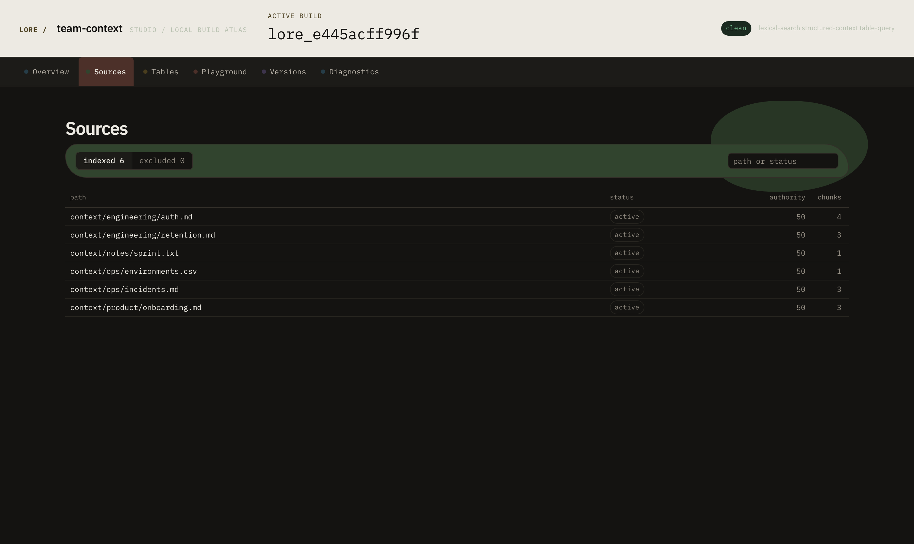
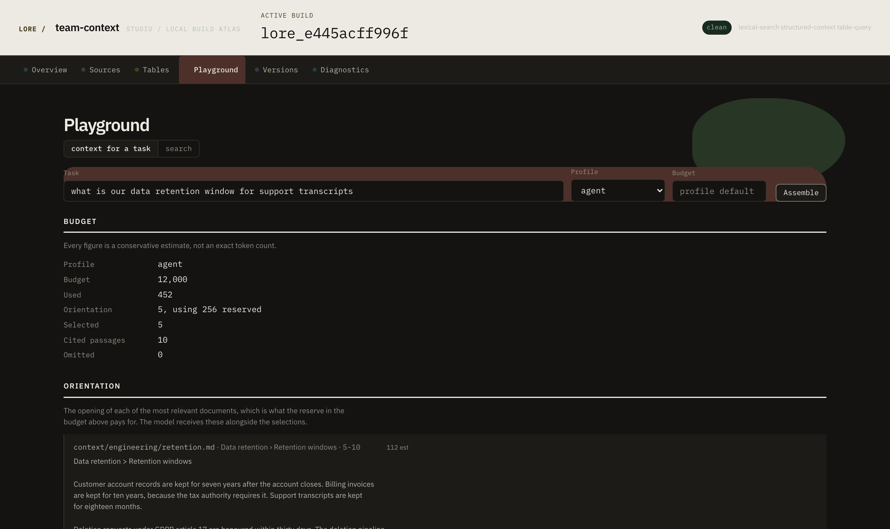
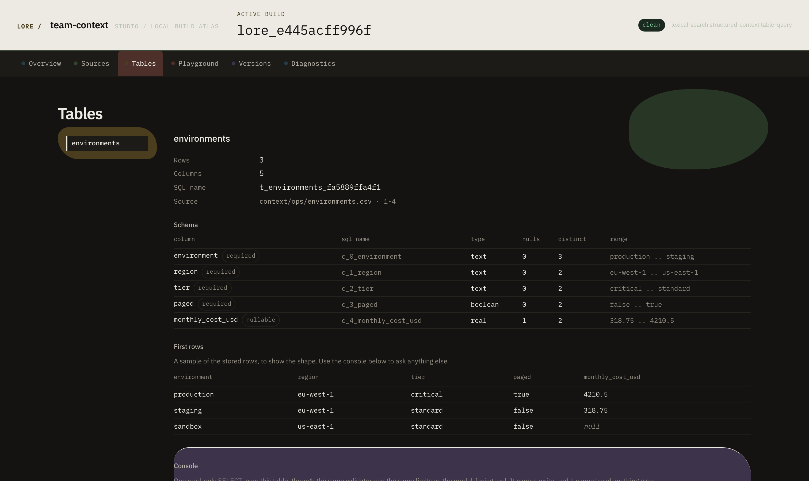
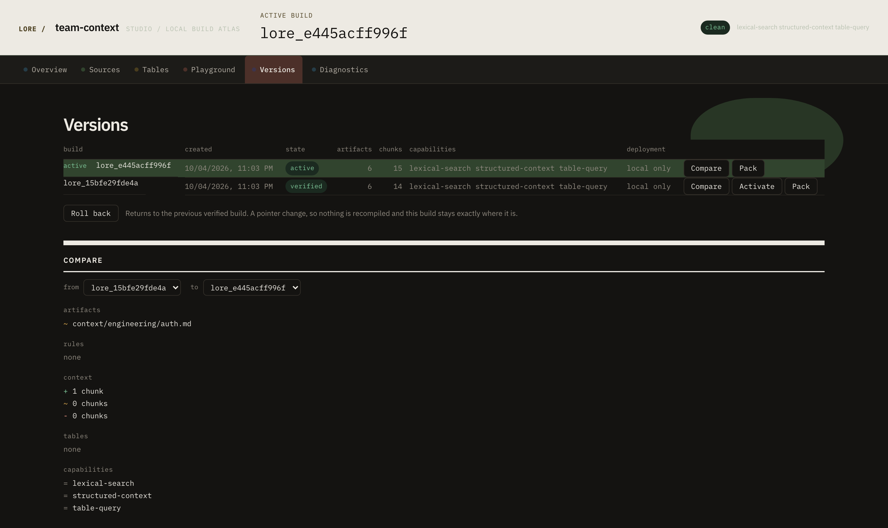
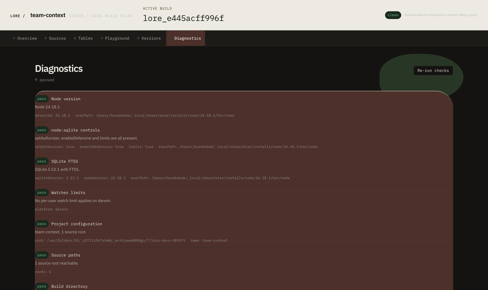

# Studio

The inspector. Six routes are served by the same process that serves the API,
on the same port, from static files built into the CLI package.

The visual direction, tokens, and anti-brief are in
[studio-design.md](./studio-design.md). The behavior and verification notes
are recorded here.

## What Studio is for

| Route | The question it answers |
|---|---|
| Overview | What is in this build, and have the sources moved since it was made? |
| Sources | Exactly what was parsed, and exactly what was not, and why |
| Playground | What would a model receive for this task, and what was left out |
| Tables | What structured data exists, and how can it be queried safely |
| Versions | What changed between builds, and which one is live |
| Diagnostics | Why is this not working, and what should be run to fix it |

Studio is read-mostly. The only actions that change anything are on Versions:
activate, roll back, and pack. They exist only under `lore dev` and refuse any
browser origin that is not a loopback literal.

## Running it

```bash
lore dev
pnpm --filter @lorepack/studio dev
```

The second command runs Vite with hot reload and proxies to a running
`lore dev` process.

## Documentation captures

Every image is generated by `pnpm docs:capture` from a real build. The capture
uses Chromium at 1512 by 900 in dark mode and covers Overview, Sources,
excluded Sources, Playground, Tables, Versions, and Diagnostics.

The screenshots are the current visual reference for the build atlas:












## Automated verification

| Suite | Command | Coverage |
|---|---|---|
| Component | `pnpm vitest run --project studio` | Route behavior and wording invariants |
| Contrast | `pnpm vitest run --project studio contrast` | Documented token pairs in both themes |
| Browser | `pnpm test:e2e` | Real `lore dev`, axe, keyboard, 1280x720, and 200% zoom |

The browser suite covers all six routes, including the table console and
version confirmation flow. Wide tables scroll inside their own box so the
navigation never moves sideways.

## Manual checklist

Automation verifies reachability, focus visibility, axe rules, and layout
constraints. A person should still verify these before a release:

1. The skip link is first and moves focus into main.
2. The route rail has a visible focus ring and the build header does not reflow.
3. Sources keeps the indexed and excluded views distinct and counts both.
4. Playground exposes task, profile, budget, assemble, citations, and omissions.
5. Versions moves focus to its confirmation heading and Escape returns focus.
6. Diagnostics exposes selectable remediation text.
7. A screen reader hears one active-build announcement after a rebuild.
8. Reduced motion removes the build settle transition.

## Recorded redesign pass

| Date | Verification | Result |
|---|---|---|
| 2026-10-04 | `pnpm lint`, `pnpm format:check`, `pnpm typecheck` | Green |
| 2026-10-04 | `pnpm test:e2e` | 31 browser tests passed across all six routes |
| 2026-10-04 | `pnpm docs:capture` and visual inspection | Seven current Studio captures regenerated and inspected |

The manual screen-reader and reduced-motion checks remain a human release
check. They are not claimed as automated results.

## What Studio will not do

There is no server-side build button, no source editing, and no route that
claims a document is wrong. The interface does not flatten structured source
content or turn ranking heuristics into truth scores.
