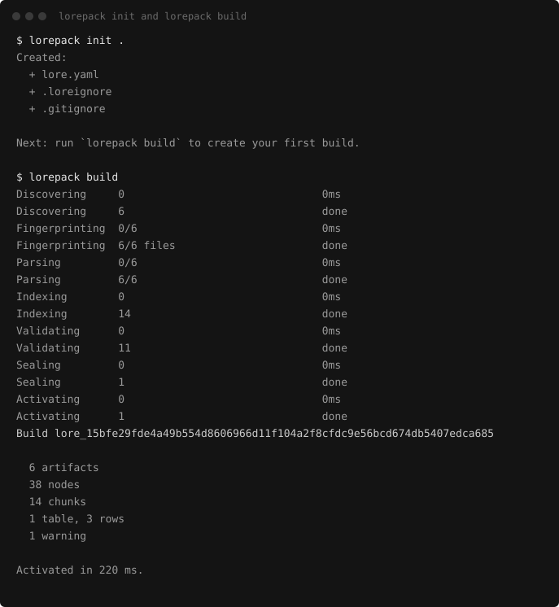
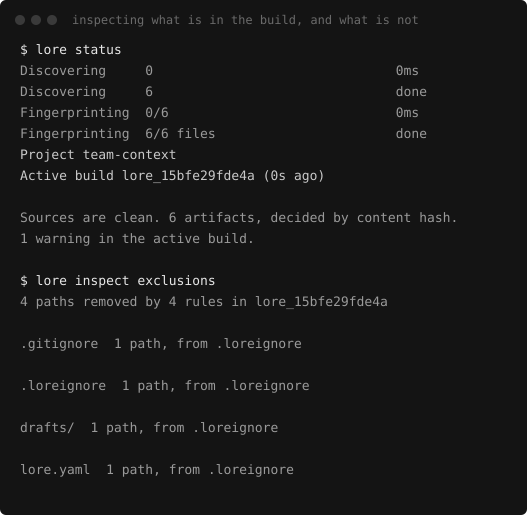
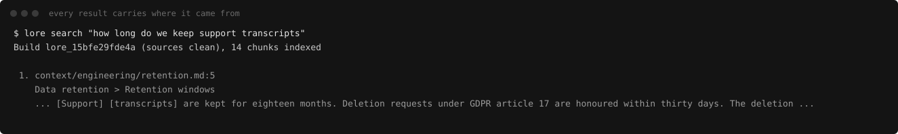

# Getting started

From nothing to an AI client answering from your documents, with a citation on every answer.

## Requirements

Node.js `>=24.15 <25`, and that is the whole list. No Python, Docker, compiler toolchain,
native add-on, model download, API key or account. The clean-install CI matrix proves it on
macOS, Linux and Windows, installing with lifecycle scripts suppressed and then running the
product.

The floor is 24.15 because that is the first release where `node:sqlite` exposes the authorizer
and per-connection limits the read-only SQL surface depends on. Lorepack also needs SQLite
compiled with FTS5, which every official Node build has. See
[SQLite FTS5 availability](compatibility/sqlite-fts5.md) for the verified matrix, and for what
happens if your build lacks it.

## Install

The alpha is available from npm on the `next` channel:

```bash
npm install -g @lorepack/cli@next
```

To contribute or try unreleased changes, install from source. That path needs pnpm, which
[Corepack](https://nodejs.org/api/corepack.html) ships with Node:

```bash
git clone https://github.com/burakdede/lorepack.git
cd lorepack
corepack enable
pnpm install --frozen-lockfile
pnpm build
alias lorepack="node $PWD/packages/cli/dist/public-entry.js"
```

The alias lasts for the current shell. Add it to your shell profile to keep it, or call
`node packages/cli/dist/public-entry.js` directly.

Once v0.1 is released, the stable install will be one command:

```bash
npm install -g @lorepack/cli
```

## Two commands

```bash
lorepack dev ./my-docs          # build the folder, serve it with Studio, rebuild on change
lorepack connect claude-code    # wire an AI client to the build, and prove it answers
```

`lorepack dev` prints everything you need: the active build, the Studio URL, the HTTP and MCP
endpoints, and a `lorepack connect` line for each AI client it finds on your machine. Clients with
their own guides:

- [Claude Code](integrations/claude-code.md)
- [Codex](integrations/codex.md)
- [VS Code](integrations/vscode.md)
- [Any MCP client](integrations/mcp.md)

For command and option completion, evaluate the generated script for your shell:

```bash
eval "$(lorepack completion zsh)"
```

Use `bash`, `fish`, or `powershell` in place of `zsh` for the other supported shells.

To try it without your own documents, point it at a checked-in example:

```bash
lorepack dev ./examples/product-research
```

## The lifecycle

Lorepack treats context the way release tooling treats code, so the useful commands come in four
families:

| Step | What happens | Commands |
|---|---|---|
| Start | Preview, build and activate an immutable version | `lorepack plan`, `lorepack build` |
| Verify | Compile and validate a candidate without moving the active pointer | `lorepack validate` |
| Change | Edit a source and see exactly what will rebuild | `lorepack plan` |
| Recover | Compare builds, and move the active pointer back without recompiling | `lorepack diff`, `lorepack rollback` |
| Deploy | Produce and verify a portable artifact, then project it remotely | `lorepack pack`, `lorepack target add cloudflare`, `lorepack deploy cloudflare` |

`pnpm demo:readme` runs that whole sequence against copies of the checked-in examples and
rewrites [`demo-transcript.md`](demo-transcript.md) with the real output. CI runs
`pnpm demo:readme:check`, so the transcript cannot drift from the product.

Every option of every command is in the [CLI reference](cli-reference.md).

## What the commands show

A build reports what it compiled:



Everything the build decided can be inspected without running it again, including the decisions
that removed a file:



Every result carries the file, the heading path and the lines it came from. A result without
them is a bug, not a style issue:



## Next

- [Studio tour](studio-tour.md): the local inspector `lorepack dev` serves.
- [Core concepts](concepts.md): why the build, not the search index, is the product.
- [Limitations](limitations.md): what v0.1 does not do.
