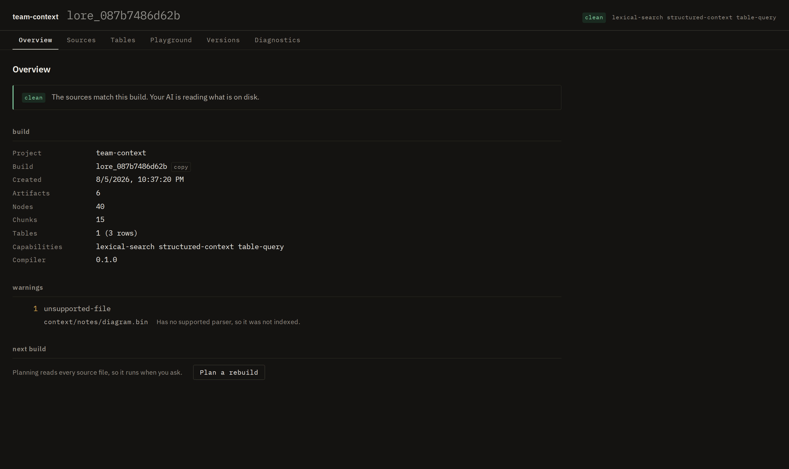
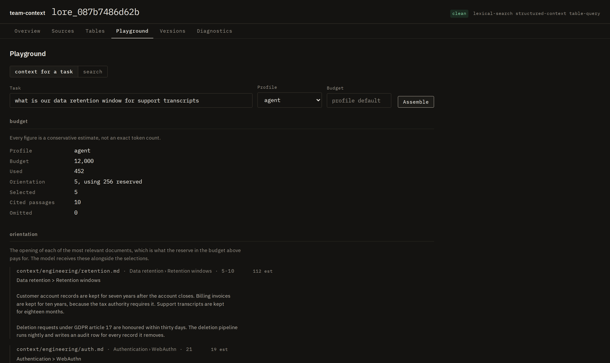
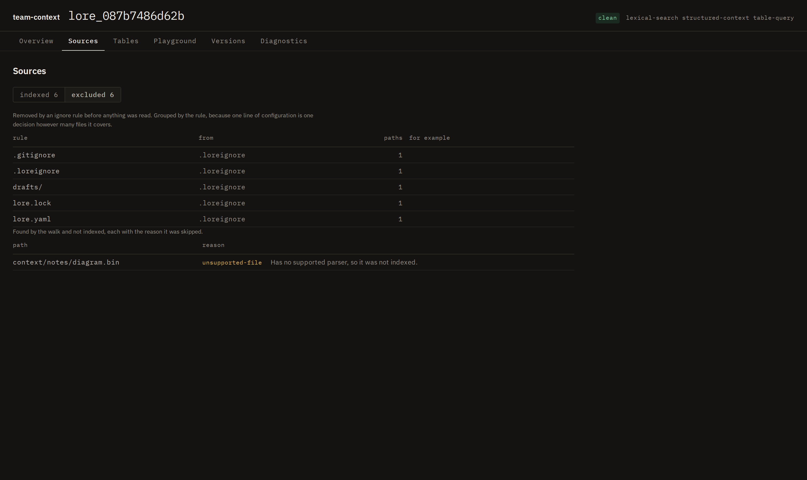
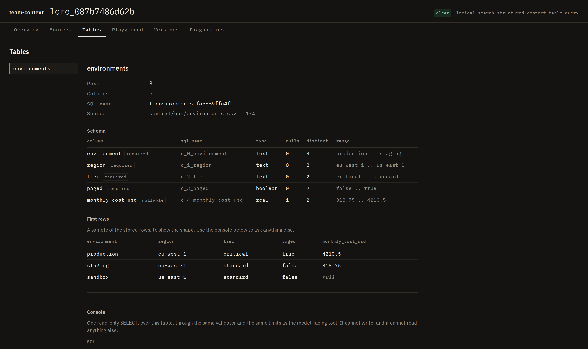
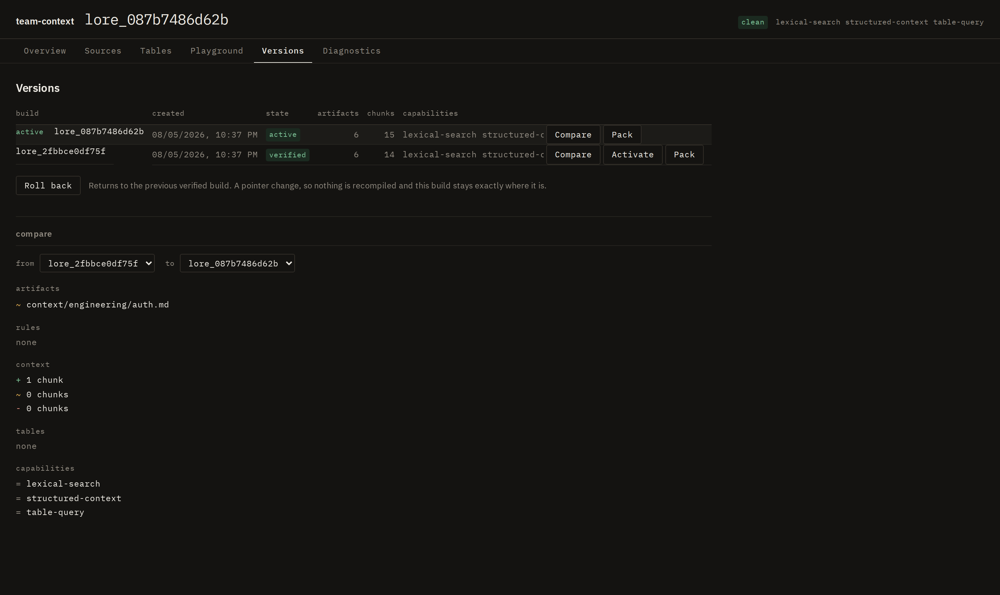
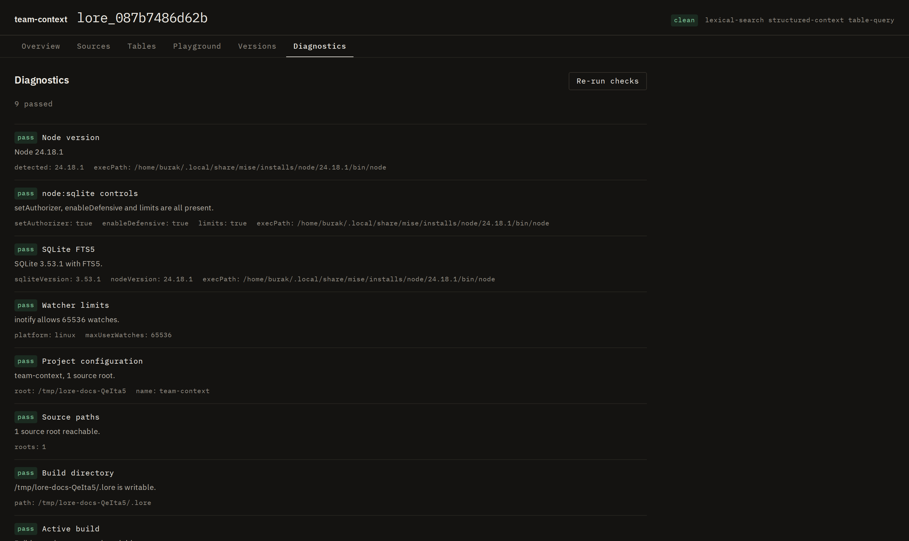

# A tour of Studio

Five routes, served from static files by the same process that serves the API, on the same
port, with no toolchain and no network. `lore dev` prints the URL.

Every image here is regenerated from a real build by `pnpm docs:capture`, so none of them is a
mockup and none of them can quietly drift from what the product does.

For the design rules behind these screens, the manual accessibility passes and the review
against the anti-brief, see [`architecture/studio.md`](architecture/studio.md).

| Route | The question it answers |
|---|---|
| Overview | What is in this build, and have the sources moved on since it was made? |
| Sources | Exactly what was parsed, and exactly what was not, and why |
| Playground | What would a model actually receive for this task, and what was left out |
| Versions | What changed between two builds, and which one is live |
| Diagnostics | Why is this not working, and what do I run to fix it |

## Overview

Source state first, because it is the only thing on the page that changes while you are reading
it. Everything else is a property of a sealed build and cannot move underneath you.

## Context Playground

The passages a model would receive for a task, each with its provenance, and every omission
with the reason it was left out.

Nothing here is presented as a score of truth. A ranking heuristic is labelled as one, and an
alternative is listed with its label rather than with a verdict.

## Sources

The half that usually gets buried: what is **not** in the build.

A rule that removed a folder and a file no parser could read are different decisions, and both
are named. An excluded directory is reported once, naming the directory, because discovery
prunes it and genuinely never looks inside.

## Tables

Appears only when the build has a table in it, which it does when the project contains a CSV or
a spreadsheet.

The schema shows each column's type, how many nulls it holds, how many distinct values, and its
range, all recorded at import so reading them costs no scan. It also shows the **generated
names**: a query addresses `t_environments_fa5889ffa4f1` and `c_0_environment`, never
`environments` and `environment`, because no identifier from a source file ever reaches SQL.

The console runs one read-only `SELECT` through the same validator, the same per-query
authorizer and the same deadline as the `lore_query_table` tool a model calls. Nothing is
reachable from this page that is not reachable from a model, which is the point of there being
one implementation rather than two. It is prefilled with a statement that already names the
generated identifiers, so the first query a person runs works.

## Versions

Every action that changes anything shows a plan, names the build it will act on, and is
confirmed first. Activation is a pointer change, so a rollback never recompiles.

## Diagnostics

The same checks `lore doctor` prints, plus what only a running session knows: the watcher, the
port, the process, and which clients are configured.

## What Studio will not do

It is read-mostly. The only routes that change anything exist solely under `lore dev`, and they
refuse any browser origin that is not a loopback literal. There is no build button that
compiles on a server, no editing of sources, and no route that claims a document is wrong.
