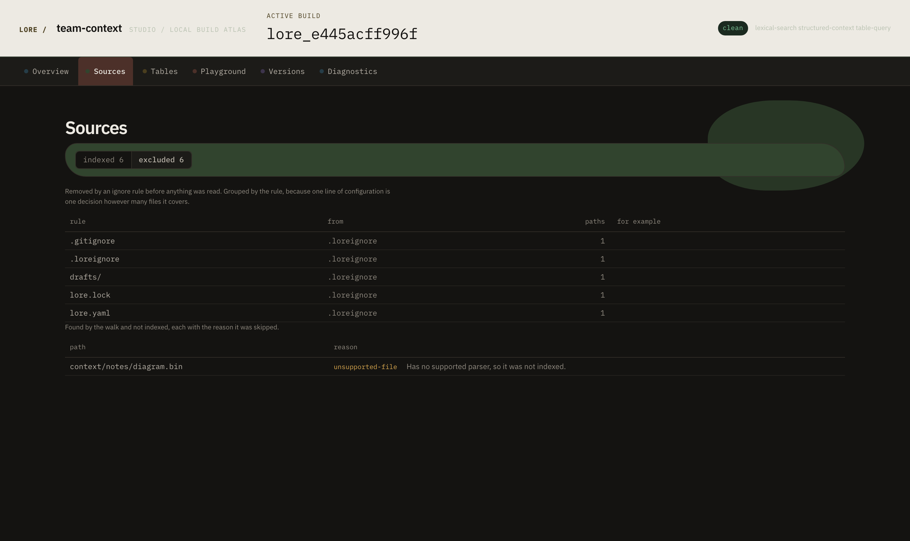
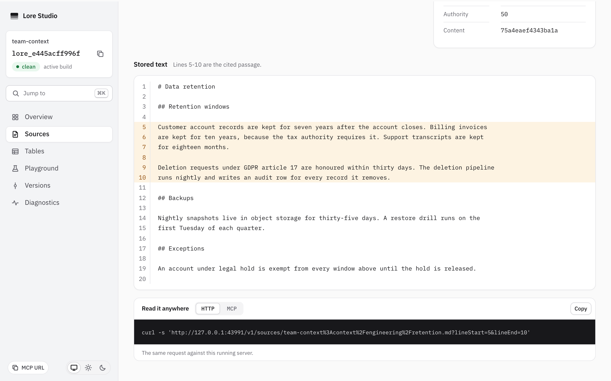
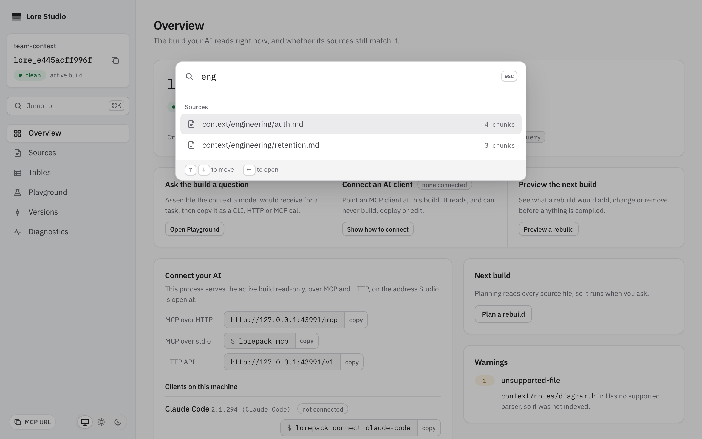

# A tour of Studio

Six routes, served from static files by the same process that serves the API,
on the same port, with no toolchain and no network. `lorepack dev` prints the URL.

Every image here is regenerated from a real build by `pnpm docs:capture`.
For the design rules and accessibility review, see
[`architecture/studio.md`](architecture/studio.md).

| Route | The question it answers |
|---|---|
| Overview | What is in this build, and have the sources moved since it was made? |
| Sources | Exactly what was parsed, and exactly what was not, and why |
| Playground | What would a model receive for this task, and what was left out |
| Tables | What structured data exists, and how can it be queried safely |
| Versions | What changed between builds, and which one is live |
| Diagnostics | Why is this not working, and what should be run to fix it |

## Overview

The active build and source state lead the page. Three next steps follow: try a
task, connect a client, and preview the next build. The Connect panel lists the
MCP and HTTP endpoints this process serves and one `lorepack connect` command for
each installed client that is not yet connected. The MCP URL is also one click
away in the sidebar.

## Sources

Indexed and excluded files are peers. A rule that removed a folder and a file
no parser could read are different decisions, and both are named.

Choosing a file shows its **stored text**: exactly what the build holds and
what `lore_read_source` returns to a model, with line numbers. Every citation
elsewhere in Studio links here, with its lines marked.

## Context Playground

The passages a model would receive for a task, each with provenance, and every
omission with the reason it was left out. **Use it anywhere** shows the same
request as a `lorepack export` command, a `curl` call and an MCP `tools/call`, so
a request tried here can be pasted into a terminal, a script or an agent. The
Tables console and the source reader offer the same panel.

## Tables

The schema shows types, nulls, distinct values, ranges, and generated query
names. The console accepts only the same read-only SQL surface available to a
model.

## Versions

Every action that changes anything shows a plan, names the build it will act
on, and is confirmed first. Activation is a pointer change, so rollback never
recompiles.

## Diagnostics

The same checks `lorepack doctor` prints, plus what only a running session knows:
the watcher, port, process, and configured clients.

## Command palette

<kbd>⌘K</kbd> (<kbd>Ctrl K</kbd> on Windows and Linux), or **Jump to** in the
sidebar, opens one index of every route, indexed source, table, and the theme
and copy actions. Arrow keys move, Enter opens, Escape returns focus to where
it was.

## Themes

The switch at the foot of the sidebar chooses system, light, or dark. The
choice is stored per browser; with storage blocked, Studio follows the system.

## What Studio will not do

It is read-mostly. There is no server-side build button, no source editing,
and no route that claims a document is wrong.
